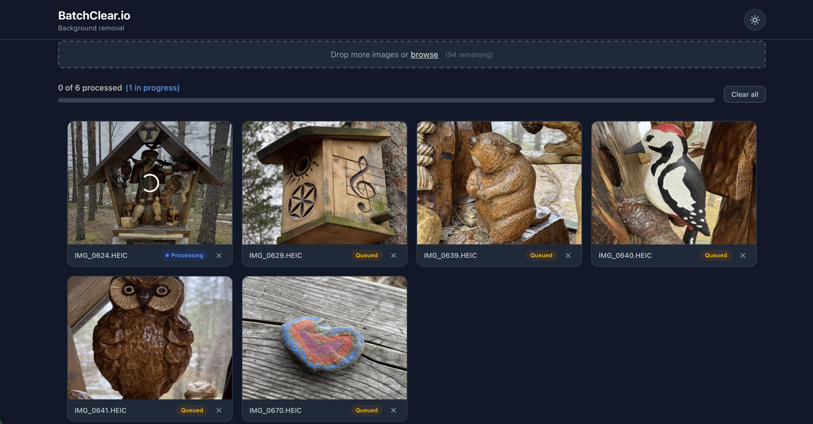
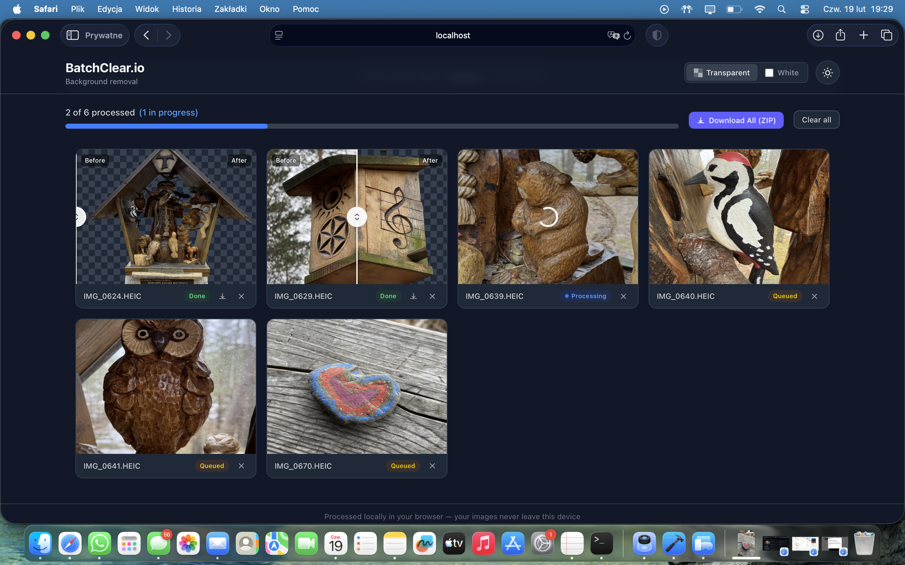
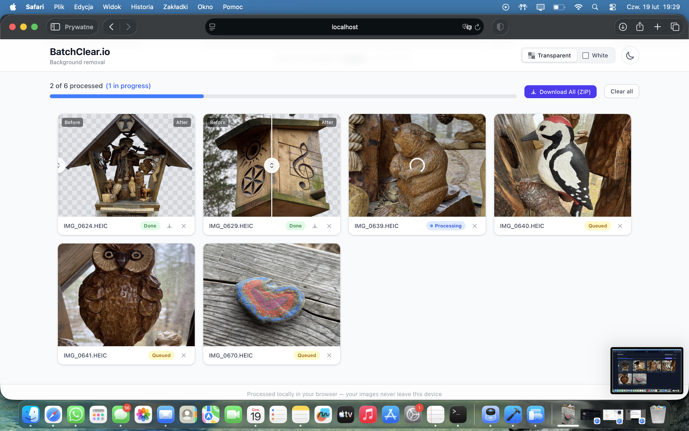

<div align="center">

# BatchClear.io

**Free, client-side batch background removal powered by AI.**

Remove backgrounds from up to 100 images at once — entirely in your browser.
No uploads, no servers, no cost.

[](LICENSE)
[](https://www.typescriptlang.org/)
[](https://react.dev/)
[](https://vite.dev/)
[](https://tailwindcss.com/)



</div>

---

## Screenshots

<table>
<tr>
<td width="50%">
<strong>Transparent background (dark mode)</strong><br>

</td>
<td width="50%">
<strong>Transparent background (light mode)</strong><br>

</td>
</tr>
<tr>
<td width="50%">
<strong>White background output</strong><br>

</td>
<td width="50%">
</td>
</tr>
</table>

## Features

- **Batch processing** — Drag & drop up to 100 images (PNG, JPG, WebP, HEIC)
- **AI-powered** — RMBG-1.4 model via Transformers.js with ONNX Runtime
- **100% private** — All processing happens locally in your browser. Images never leave your device
- **Transparent or white background** — Toggle between PNG (transparent) and JPG (white) output
- **Before/after slider** — Compare original and processed images side by side
- **Batch ZIP download** — Download all results as a single ZIP, or grab individual images
- **Dark/light theme** — Automatic system detection with manual toggle
- **Responsive** — Works on desktop, tablet, and mobile
- **HEIC support** — iPhone photos converted automatically

## How It Works

```
Drag & Drop → Web Worker AI Inference → Canvas Compositing → Download
```

1. **Drop images** onto the upload zone
2. A dedicated **Web Worker** loads the RMBG-1.4 ONNX model and runs inference — the UI stays fully responsive
3. The segmentation mask is composited onto the original image at **full resolution** using OffscreenCanvas
4. **Download** individual results or everything as a ZIP

The AI model (~35 MB) downloads once and is cached by the browser. Subsequent visits load instantly.

## Tech Stack

| Layer | Technology |
|-------|-----------|
| Framework | React 19 |
| Build | Vite 6 |
| Styling | Tailwind CSS 4 |
| Language | TypeScript 5.7 |
| AI Model | [RMBG-1.4](https://huggingface.co/briaai/RMBG-1.4) via [Transformers.js](https://huggingface.co/docs/transformers.js) |
| Runtime | ONNX Runtime (WebAssembly + SIMD) |
| Threading | Web Workers + `crossOriginIsolated` for WASM multithreading |
| Compression | [fflate](https://github.com/101arrowz/fflate) for streaming ZIP generation |
| Upload | [react-dropzone](https://react-dropzone.js.org/) |
| HEIC | [heic-to](https://github.com/nicolo-ribaudo/heic-to) |

## Getting Started

```bash
# Clone the repository
git clone https://github.com/selter2001/BatchClear.io.git
cd BatchClear.io

# Install dependencies
npm install

# Start development server
npm run dev

# Production build
npm run build

# Deploy to GitHub Pages
npm run deploy
```

## Architecture

```
src/
├── components/        # React UI components
│   ├── App.tsx        # Main app + state management (useReducer)
│   ├── ImageCard.tsx  # Per-image card with status + download
│   ├── ImageGrid.tsx  # Responsive grid layout
│   ├── BeforeAfter.tsx # CSS clip-path comparison slider
│   ├── DropZone.tsx   # react-dropzone integration
│   └── ...
├── lib/
│   ├── compositor.ts  # OffscreenCanvas mask compositing
│   ├── download.ts    # fflate ZIP + individual download
│   ├── thumbnail.ts   # Display-size thumbnail generation
│   ├── queue.ts       # p-limit concurrency control
│   └── types.ts       # TypeScript interfaces
└── workers/
    └── inference.worker.ts  # RMBG-1.4 model loading + inference
```

## Privacy

All image processing runs locally in your browser using WebAssembly. **No images are ever uploaded to any server.** There is no backend, no analytics, no tracking, and no data collection.

## License

[MIT](LICENSE)
